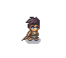
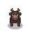
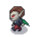

# 🎮 โครงงานเกม PLATFORMER 2D  
**วิชา**: CP352203 - Computer Game Development  
**ภาคการศึกษา**: ต้น ปีการศึกษา 2568  

---

## 👨‍💻 ผู้จัดทำ
- 653380187-0 นางสาวกรกนก พฤทธิ์พันธุ์ (CS2)  
- 653380321-2 กุลนิษฐ์ เตียวรัตนศิริ (CS2)  
- 653380207-0 นายพงษ์วรินทร์ แก้วสง่า (CS2)  
- 653380339-3 นายภูมินทร์ บุญทวี (CS2)  

-----

## 🏰 ชื่อเกม  
**ชาวนาตามหาควายหาย (Buffalo Gone Missing)**  

---

## 🎨 ธีม หรือ แนวเกม  
Platformer 2D คลาสสิกในสไตล์ **Pixel Art**  

---

## 📖 เนื้อเรื่องย่อ  
ณ หมู่บ้านเล็ก ๆ แห่งหนึ่ง ชาวนาธรรมดาผู้มีชีวิตเรียบง่ายตื่นขึ้นมาเพื่อจะออกไปไถนาเหมือนเช่นทุกวัน แต่สิ่งที่เขาไม่คาดคิดก็เกิดขึ้น — ควายคู่ใจและเพื่อนสนิทที่อยู่เคียงข้างมาตลอดได้หายตัวไปอย่างลึกลับ  

ด้วยความเป็นห่วง เขาจึงออกเดินทางตามร่องรอยเพื่อตามหาควายที่หายไป จนได้รู้ข่าวลือว่ามีกลุ่มลัทธิลึกลับนำควายไปเพื่อใช้ในพิธีบูชายัญ ณ ปราสาทเก่าแก่สุดขอบหมู่บ้าน  

การเดินทางของชาวนาเต็มไปด้วยอุปสรรค ไม่ว่าจะเป็นเหว หุบเขา ป่าอันตราย และกับดักที่พร้อมพรากชีวิตได้ทุกเมื่อ ยิ่งไปกว่านั้น เขายังต้องต่อกรกับเหล่า **แวมไพร์** ที่ปรากฏตัวขึ้นเป็นศัตรูคอยขัดขวางตลอดเส้นทาง  

**ภารกิจของผู้เล่น** คือการนำพาชาวนาให้ฝ่าฝันอุปสรรค กระโดดหลบหลีกศัตรู ต่อสู้กับแวมไพร์ และไปถึงปราสาทให้สำเร็จ เพื่อช่วยเหลือควายเพื่อนสนิทออกมาจากพิธีบูชายัญ ก่อนที่ทุกอย่างจะสายเกินไป…  

---

## 👤 ตัวละคร  

- **ชาวนา (ตัวละครหลัก / ผู้เล่น)**  
  - ตัวเอกของเรื่อง ผู้เล่นสามารถควบคุมการวิ่ง กระโดด และกระโดดทับศัตรู  
  - เป้าหมายคือช่วยควายเพื่อนรักให้สำเร็จ
 
    

- **ควาย (เพื่อนสนิท)**  
  - เพื่อนคู่ใจของชาวนาที่ถูกจับไป แม้ไม่ได้ควบคุม แต่เป็นแรงผลักดันในการเล่นเกม
  

- **แวมไพร์ (ศัตรูหลัก)**  
  - ศัตรูที่เดินไปมาเพื่อโจมตี  
  - ทำหน้าที่เป็นบอสหรืออุปสรรคสำคัญ
  
---

## 🎮 รูปแบบการเล่น และ กติกา  

**การควบคุมตัวละคร**  
- A : เดินไปทางซ้าย  
- D : เดินไปทางขวา  
- Space Bar : กระโดด  
- S : ลงท่อ
- Shift : เร่งความเร็ว

**ภารกิจหลัก**  
- เคลื่อนที่ไปข้างหน้าและหลบหลีกแวมไพร์  
- กระโดดทับศัตรูเพื่อกำจัด  
- เก็บเหรียญเพื่อสะสมคะแนน  
- ลงท่อเพื่อเข้าสู่พื้นที่ลับ  
- ไปถึงจุดสุดท้าย (ปราสาท) โดยไม่เสียชีวิต  

**ศัตรูและอุปสรรค**  
- ศัตรูอาจเดินไปมา หรือบินได้  
- ผู้เล่นต้องระวังสิ่งกีดขวาง เช่น หลุม กับดัก  
- หากโดนโจมตีหรือตกหลุม = เสียชีวิต  

---

## 💡 แนวคิดการออกแบบ  

**4.1 ธีมหลักของเกม**  
- เกมถูกออกแบบให้เป็น **2D Platformer** ผสมบรรยากาศชนบทไทยกับแฟนตาซีสยองขวัญ  
- สะท้อนคุณค่าความผูกพันระหว่างคนกับสัตว์  

**4.2 สไตล์ภาพและศิลปะ (Art Style)**  
- Pixel Art คลาสสิก  
- มีองค์ประกอบท้องถิ่น เช่น ควาย ทุ่งนา ป่าไผ่ และปราสาทร้าง  
- โทนสีสดใสในช่วงแรก ค่อย ๆ มืดลงเมื่อใกล้ถึงปราสาท  

**4.3 ระบบการเล่น (Gameplay Mechanics)**  
- การเคลื่อนที่: เดิน วิ่ง กระโดด  
- การกำจัดศัตรู: กระโดดทับ หรือหลบหลีก  
- ระบบท่อ/ทางลับ: เข้าสู่พื้นที่พิเศษ  
- การเก็บสะสม: พริกและไอเท็มเพื่อเพิ่มคะแนน  
- ระบบชีวิต: จำนวนชีวิตจำกัด หากพลาดต้องเริ่มใหม่จากจุดเซฟ  

**4.4 อารมณ์และประสบการณ์ที่อยากมอบให้ผู้เล่น**  
- ความสนุกท้าทายในการกระโดดและหลบศัตรู  
- ความรู้สึกผูกพันและอยากช่วยเหลือเพื่อน  
- ความพึงพอใจจากการเอาชนะอุปสรรค  

**4.5 แรงบันดาลใจ (Inspiration)**  
- Super Mario Bros. (Platformer)  
- เรื่องเล่าพื้นบ้านไทย (ชาวนา + ควาย)  
- การผสมผสาน “พื้นบ้าน” เข้ากับ “แฟนตาซี”  

---

## 🎯 กลุ่มเป้าหมาย (ผู้เล่น)  

**5.1 นักเรียนและนักศึกษา**  
- อายุ 12–25 ปี  
- ต้องการเกมเล่นง่าย สนุก และคลายเครียด  

**5.2 ผู้เล่นทั่วไปที่ชื่นชอบเกมคลาสสิก**  
- ผู้ที่เคยเล่น Platformer เช่น Mario  
- ต้องการประสบการณ์ใหม่ที่ยังคงกลิ่นอายความคลาสสิก  

**5.3 ผู้ที่สนใจการพัฒนาเกม**  
- ใช้เป็นตัวอย่างศึกษาโครงสร้างเกม 2D ด้วย Godot Engine  

---

## 📊 การวิเคราะห์เกม AGE Analysis  

**6.1 Aesthetics (ความสวยงามและงานศิลป์)**  
- Pixel Art 2D ผสมความเป็นไทย เช่น ทุ่งนา ควาย ป่าไผ่  
- โทนสีเปลี่ยนตามบรรยากาศ: สดใส → มืดทึบ → หลอน (ปราสาท)  
- เสียงประกอบ: ดนตรีผจญภัย, เอฟเฟกต์เสียงกระโดด/เก็บพริก/ถูกโจมตี  

**6.2 Gameplay (รูปแบบการเล่นและกติกา)**  
- การควบคุม: A/D/W/S  
- ภารกิจหลัก: กระโดดทับศัตรู เก็บพริก หลีกเลี่ยงอุปสรรค ลงท่อเข้าสู่พื้นที่ลับ  
- ด่าน: เริ่มจากทุ่งนา → ป่า/ภูเขา → ปราสาท (Boss Fight)  
- ระบบชีวิต: ตายเมื่อโดนโจมตีหรือตกหลุม เริ่มใหม่จากจุดเซฟ  

**6.3 Experience (ประสบการณ์ที่ผู้เล่นได้รับ)**  
- ผู้เล่นรู้สึกผูกพันกับชาวนาและควาย  
- ได้ความท้าทายจากการหลบศัตรูและผ่านอุปสรรค  
- ความสนุกจากการลองผิดลองถูก  
- ความตื่นเต้นจากการเจอบอส  
- แรงจูงใจ: เก็บคะแนน เส้นทางต่าง ๆ และอยากรู้ตอนจบ  

---

## 📷 Screenshots  

### 🟩 Tileset  

### 🕹️ หน้าเกม (ฉากเมนู)  

### 🕹️ ตัวอย่างการเล่น  

---

## 📌 Credits  
- **Game Template**: มาจาก [SMB Games](https://www.smbgames.be/)  
- **Assets**: มาจาก [Craftpix](https://craftpix.net/) และ [The Spriters Resource](https://www.spriters-resource.com/)  

---
## 📌 รันเกมบน Web
https://kullanittian12.github.io/projectgame2d/
